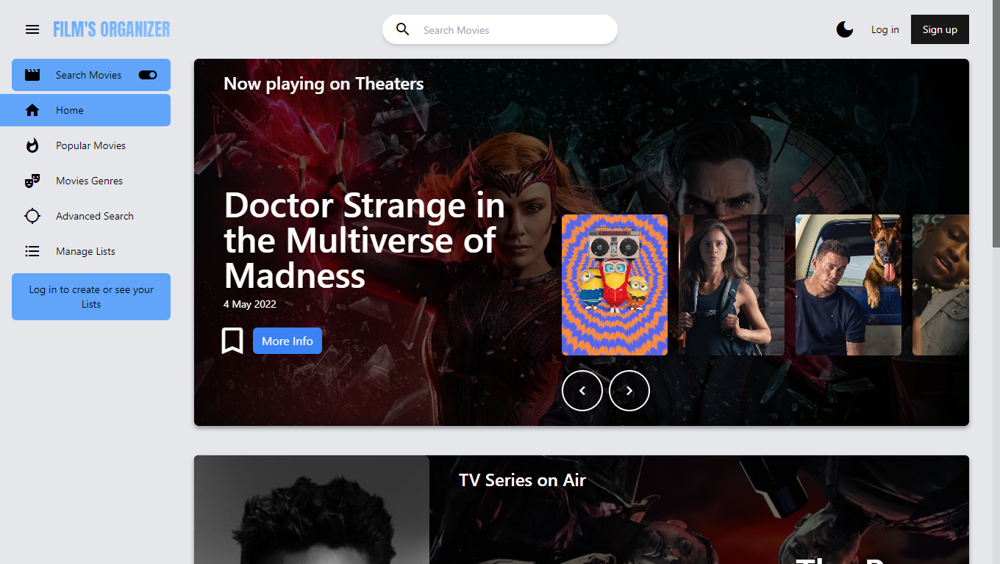
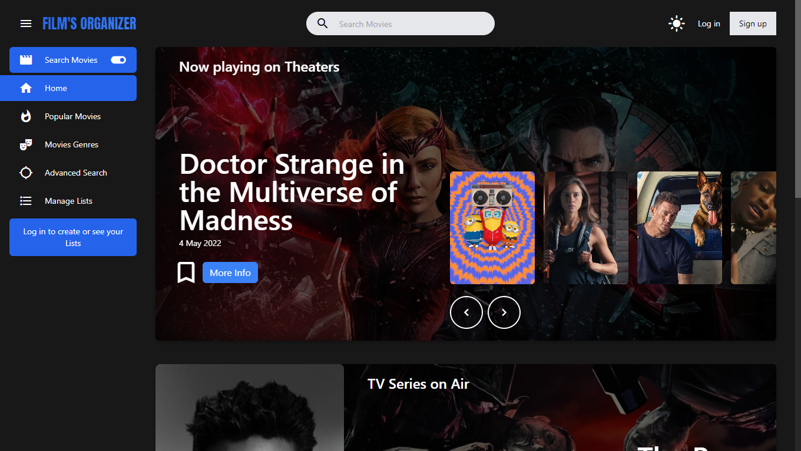
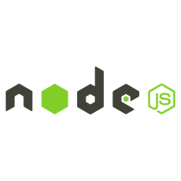

# Film Organizer

Film organizer is a full stack MERN application (MongoDB, Express, React, NodeJS).
You can Sign up using a Google account or your own email and password.

### Discovering Movies and Shows

Find out wich Movies or Shows are on theaters, on air, or wich will be releasing soon in the home page.
Or search for specific Movies or Shows with the many ways that Film Organizer allows it.

### Creating your own Lists

Once you're logged you can create lists to and save Movies and Shows to them.

### Dark Mode! 🌙

## Languages used in the App

### Frontend

-  React
   &nbsp;
-    Javascript 
   &nbsp;
-   HTML 
   &nbsp;
-   SCSS 
   &nbsp;
-    Tailwind (to simplify styling) 

### Backend

-   Node JS 
   &nbsp;
-   Express 
   &nbsp;
-    MongoDB 
